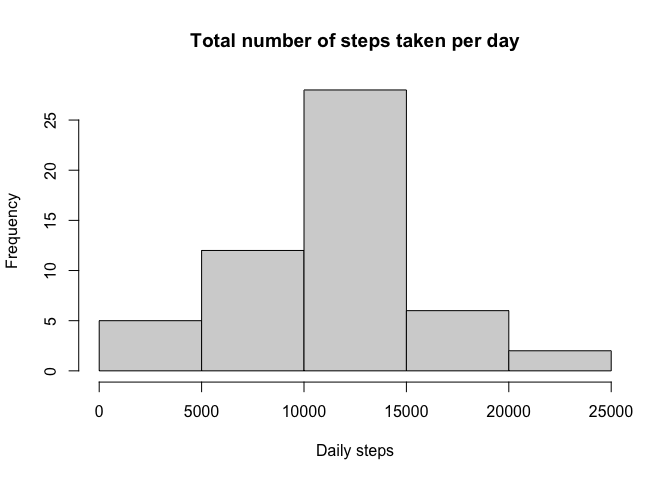
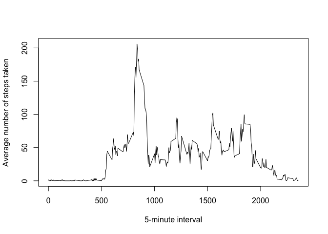
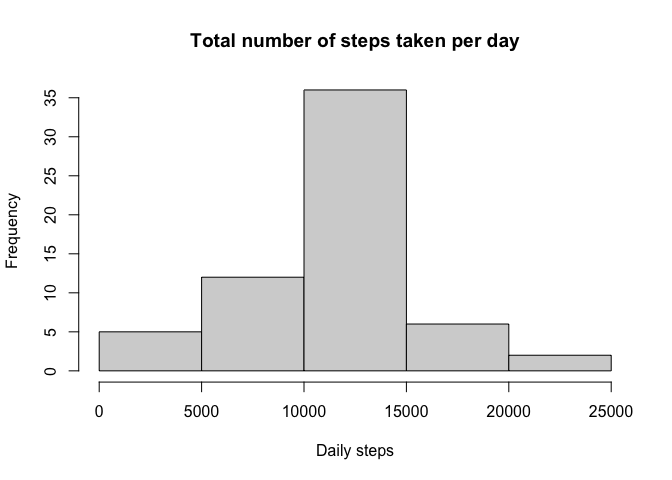

## Loading and preprocessing the data


```r
activity <- unzip("activity.zip")
activitydf <- read.csv(activity)
library(lubridate)
```

```
## 
## Attaching package: 'lubridate'
```

```
## The following objects are masked from 'package:base':
## 
##     date, intersect, setdiff, union
```

```r
activitydf$date <- ymd(activitydf$date)
```

## What is mean total number of steps taken per day?

1. Make a histogram of the total number of steps taken each day


```r
library(dplyr)
```

```
## 
## Attaching package: 'dplyr'
```

```
## The following objects are masked from 'package:stats':
## 
##     filter, lag
```

```
## The following objects are masked from 'package:base':
## 
##     intersect, setdiff, setequal, union
```

```r
dailystep <- activitydf %>%
        group_by(date) %>%
        summarize(dailysteps = sum(steps))
```

```
## `summarise()` ungrouping output (override with `.groups` argument)
```

```r
hist(dailystep$dailysteps, 
     main = "Total number of steps taken per day", xlab = "Daily steps",
     las = 0, freq = TRUE)
```

<!-- -->

2. Calculate and report the **mean** and **median** total number of steps taken per day


```r
meanstep <- mean(dailystep$dailysteps, na.rm = TRUE)
meanstep
```

```
## [1] 10766.19
```

```r
medianstep <- median(dailystep$dailysteps, na.rm = TRUE)
medianstep
```

```
## [1] 10765
```

## What is the average daily activity pattern?

1. Make a time series plot (i.e. `type = "l"`) of the 5-minute interval (x-axis) and the average number of steps taken, averaged across all days (y-axis)


```r
intervalstep <- activitydf %>%
        group_by(interval) %>%
        summarize(averagesteps = mean(steps, na.rm = TRUE))
```

```
## `summarise()` ungrouping output (override with `.groups` argument)
```

```r
plot (x = intervalstep$interval, y = intervalstep$averagesteps, type = "l", 
      xlab = "5-minute interval",
      ylab = "Average number of steps taken")
```

<!-- -->

2. Which 5-minute interval, on average across all the days in the dataset, contains the maximum number of steps?


```r
sortintervalstep <- arrange(intervalstep, desc(averagesteps))
sortintervalstep$interval[1]
```

```
## [1] 835
```

## Imputing missing values

Note that there are a number of days/intervals where there are missing
values (coded as `NA`). The presence of missing days may introduce
bias into some calculations or summaries of the data.

1. Calculate and report the total number of missing values in the dataset (i.e. the total number of rows with `NA`s)


```r
activitydf2 <- mutate(activitydf, missing = is.na(steps))
sum(activitydf2$missing)
```

```
## [1] 2304
```

2. Fill in all of the missing values in the dataset using the mean for that 5-minute interval
   and create a new dataset that is equal to the original dataset but with the missing data    filled in.
   

```r
activitydf3 <- activitydf %>% group_by(interval) %>%
   mutate(steps=ifelse(is.na(steps),mean(steps,na.rm=TRUE),steps))
```
   
3. Make a histogram of the total number of steps taken each day and Calculate and report the **mean** and **median** total number of steps taken per day. Do these values differ from the estimates from the first part of the assignment? What is the impact of imputing missing data on the estimates of the total daily number of steps?


```r
dailystep2 <- activitydf3 %>%
        group_by(date) %>%
        summarize(dailysteps = sum(steps))
```

```
## `summarise()` ungrouping output (override with `.groups` argument)
```

```r
hist(dailystep2$dailysteps, 
     main = "Total number of steps taken per day", xlab = "Daily steps",
     las = 0, freq = TRUE)
```

<!-- -->

```r
meanstep2 <- mean(dailystep2$dailysteps)
meanstep2
```

```
## [1] 10766.19
```

```r
medianstep2 <- median(dailystep2$dailysteps)
medianstep2
```

```
## [1] 10766.19
```

```r
identical(meanstep, meanstep2)
```

```
## [1] TRUE
```

```r
identical(medianstep, medianstep2)
```

```
## [1] FALSE
```

## Are there differences in activity patterns between weekdays and weekends?

The dataset with the filled-in missing values was used for this part.

1. Create a new factor variable in the dataset with two levels -- "weekday" and "weekend" indicating whether a given date is a weekday or weekend day.


```r
activitydf4 <- mutate(activitydf3, day = wday(date))
activitydf4 <- mutate(activitydf4, weekend = ifelse(day%in% c(1, 7),"weekend","weekday"))
activitydf4$weekend <- factor(activitydf4$weekend)
```

2. Make a panel plot containing a time series plot (i.e. `type = "l"`) of the 5-minute interval (x-axis) and the average number of steps taken, averaged across all weekday days or weekend days (y-axis). 


```r
intervalstep2 <- activitydf4 %>%
        group_by(interval, weekend) %>%
        summarize(averagesteps = mean(steps))
```

```
## `summarise()` regrouping output by 'interval' (override with `.groups` argument)
```

```r
library(lattice)
xyplot(averagesteps~interval | weekend, data = intervalstep2, layout = c(1, 2), type = "l",
       xlab = "Interval",
       ylab = "Number of steps")
```

<!-- -->
